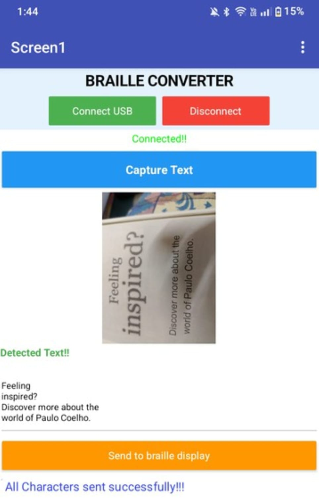
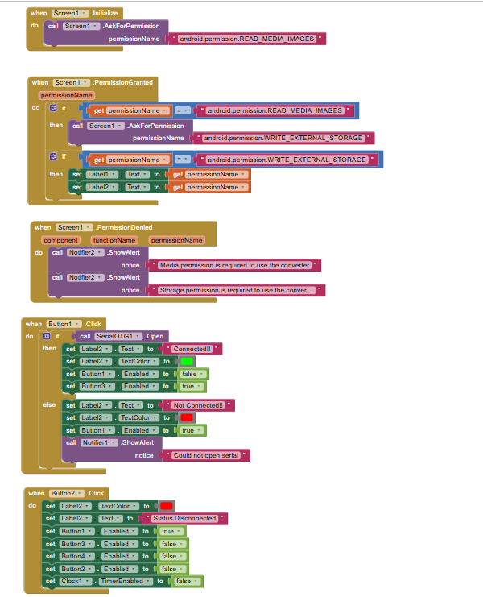
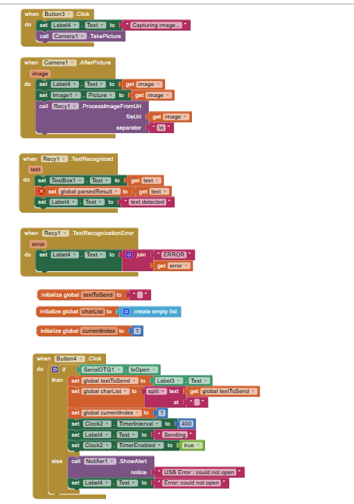
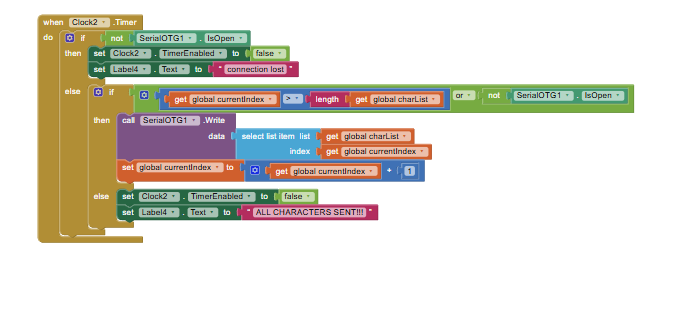
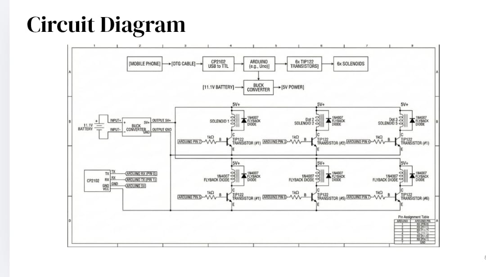
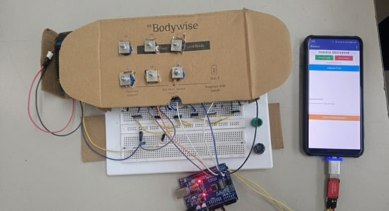

# ♿ Realtime Braille Conversion for Digital Content

## 📌 Overview
This project converts digital text into Braille format in real-time using a mobile application, helping visually impaired users access digital content easily.

## 🎯 Objective
To design an app-controlled system that translates text into Braille output.

## ⚙️ Working
- User inputs text through the mobile app
- The app processes the text
- The system converts it into Braille output

## 🛠️ Technologies Used
- MIT App Inventor
- Embedded System / Hardware Interface

## 📱 App Interface

## 🧩 Block Programming

## 🔧 Circuit Diagram

## 📊 Output

## 🌍 Applications
- Assistive devices for visually impaired
- Educational tools
- Accessibility systems

## 🏆 Achievements
- Selected among **Top 20** projects in Plutonium 2026
- Awarded participation certificate
